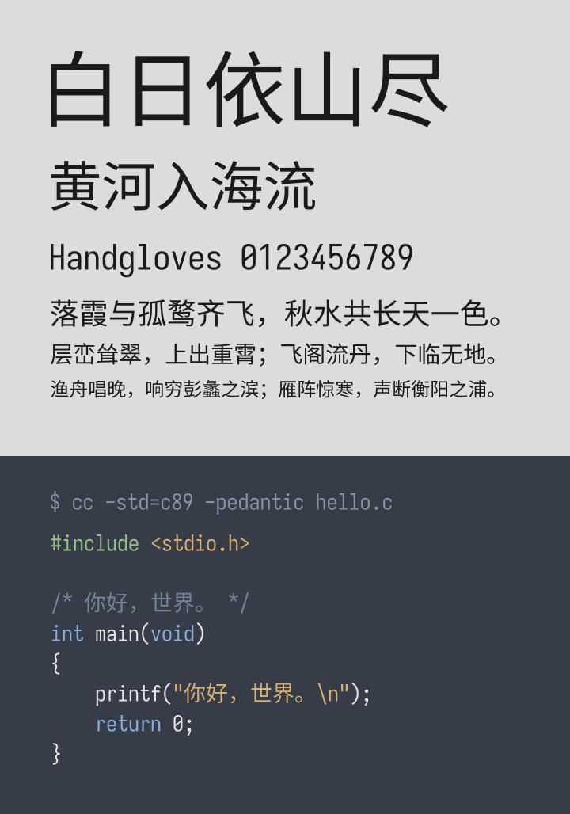

# 星霞黑体 GlowHei



屏幕显示用的中文黑体，与星霞宋体成对。字符集到 GBK（CP936）级，另附 CJK 扩展 A
的缺字回退。每个字符集有比例与等宽两款，字形与度量完全相同，区别只在
`isFixedPitch` 与 PANOSE 两个标志位。ASCII 一律半角（0.5 em），全角一律 1 em，
字体只有这两种宽度。

行距 1.141 em，与星霞宋体相同，两款可以混排或互换。

## 这里有什么

字体是单一许可，直接装就行，不需要像姊妹项目那样在本地拼合。

| 目录 / 文件 | 内容 | 许可 |
|---|---|---|
| `glowhei-1.000/` | 三个字体文件与全部构建源码 | SIL OFL 1.1 |
| `sbitgraft-1.000/` | 去掉 hinting 的工具，单个 C 文件 | MIT |
| `65-glowhei.conf`、`check-fontconfig.sh` | fontconfig 配置与自查脚本 | CC0 1.0 |
| `APPENDIX-toolkits.md` | 各桌面工具包行为的实测记录（英文） | CC0 1.0 |

各目录下的 `README.md` 讲自己那一份怎么用。

## 装上

Linux：

```sh
FONT=glowhei-1.000

mkdir -p ~/.local/share/fonts ~/.config/fontconfig/conf.d
cp "$FONT"/GlowHei-GBK.ttc "$FONT"/GlowHei-ExtA.ttf ~/.local/share/fonts/
cp 65-glowhei.conf ~/.config/fontconfig/conf.d/
fc-cache -f
```

`fc-cache -f` 不能省。配置用一条扫描期规则修正等宽分类，而字体列表建自扫描缓存，
不重建缓存的话旧判定会留着。

Windows：右键安装 `glowhei-1.000/` 里的 TTC。

## fontconfig 配置管三件事

一是等宽分类：fontconfig 按 advance 的种类推断 `spacing`，半宽 ASCII 配全宽汉字必然
被判为 `FC_DUAL`（90）而非 `FC_MONO`（100），于是 Qt 与 TDE 的等宽字体列表里没有本
字体。它不读 `post.isFixedPitch` 也不读 PANOSE，这一点在字体内部无法修正。

二是 `hintstyle`：本字体带自己的 TrueType 指令，而 `hintslight` 会改用 FreeType 的
自动 hinter 并把那些指令丢掉，必须用 `hintfull`。

三是把 `SimHei` 与 `黑体` 指向本字体，以及 Ext A 的缺字回退。

配置**不**抢占 `sans-serif` 等泛型族——装一款字体不该替你决定桌面的默认字体，那在
桌面环境的设置里改。装完可跑 `sh check-fontconfig.sh` 自查。

取舍与源码出处记在 `APPENDIX-toolkits.md`，打包者与提 bug 的人用得上。

## 项目

源码与问题跟踪：<https://github.com/lunzima/GlowHei>
联系：lunzima@lunzima.net

## 许可

字体与构建源码为 SIL OFL 1.1，全文见 `LICENSE`，上游声明也在其中。fontconfig 那两个
文件与技术附录是 CC0，全文见 `LICENSE-CC0`，抄走改用不必署名。`sbitgraft-1.000/`
是 MIT，全文见该目录下的 `LICENSE`。

字体的 `fpgm` 表内含 Chlorophytum 的运行时函数库，该工具为 MIT，全文见
`LICENSE-MIT`。
